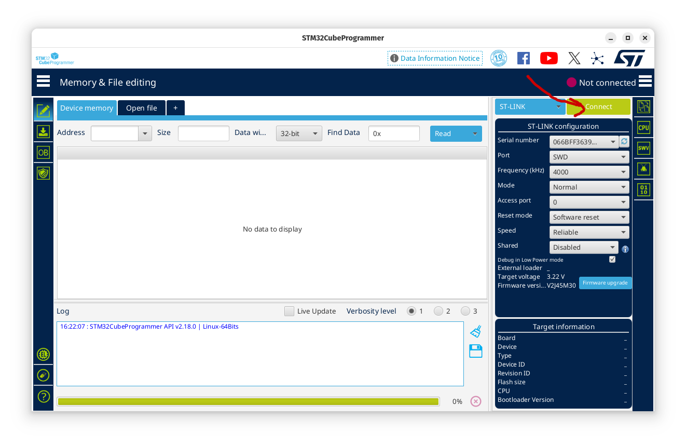
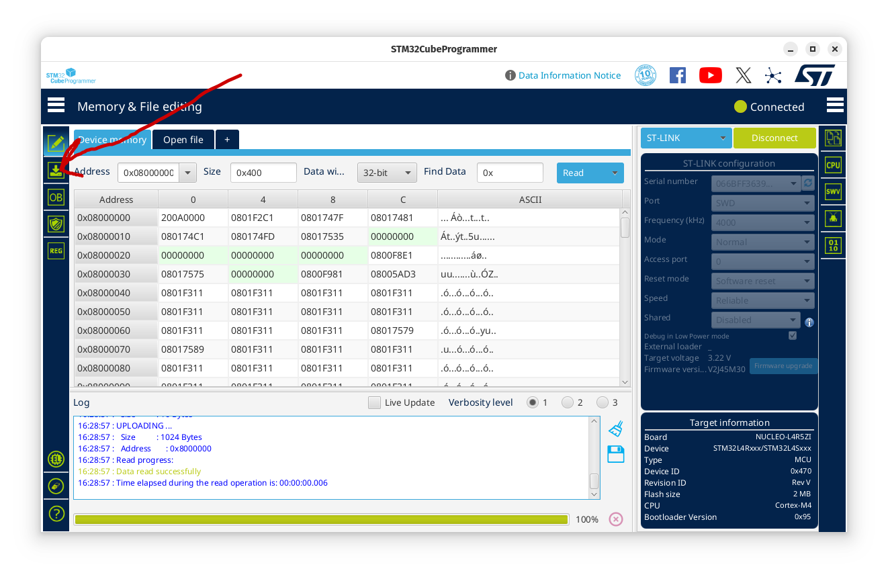
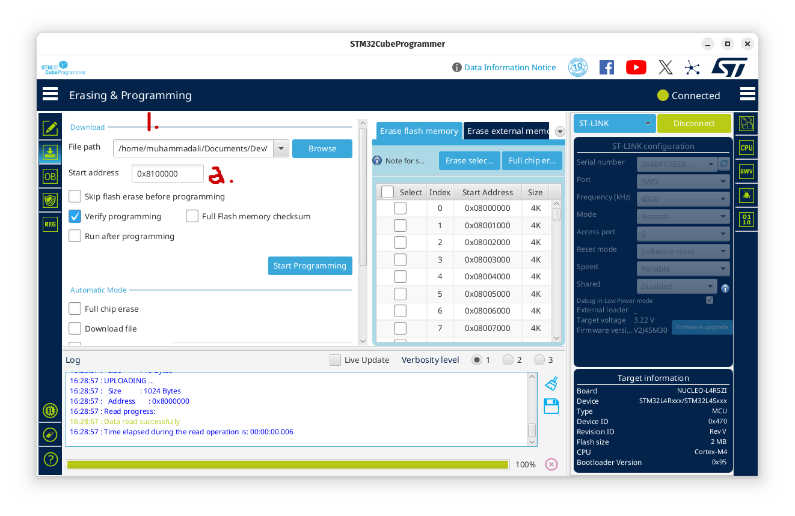
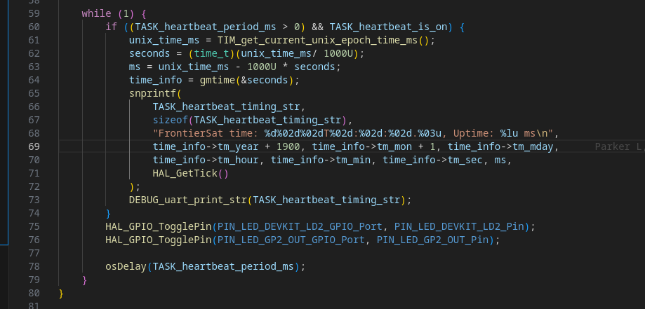
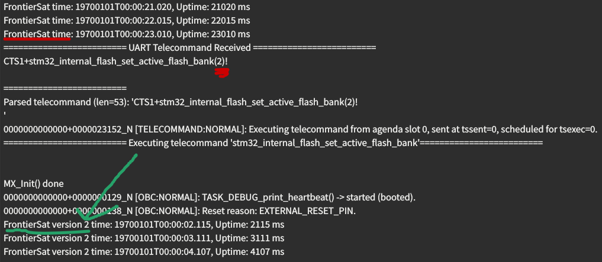

## Notes
1. You will need the stm32-for-vscode extension (up-to-date version). **It is important that it is up to date**
2. You will need the `STM32CubeProgrammer` which is downloadable from the stm32 website

# Testing Steps
1. Checkout this branch `ali-restore-golden-copy-i24`
2. Open a serial terminal with the appropriate UART configurations.
3. `Clean Build` the project and `Flash` it to your STM32
4. Ensure that it is working as normal.
5. Open the STM32CubeProgrammer and connect it to you STM32 Microcontroller
	1. 
	2. This will cause your STM to pause. Your serial test will not be receiving anything new. (You can reset your STM32 manually by pressing the reset button on the microcontroller to resume it working while still being connected).
	3. Click the `Upload` button on the left toolbar. It is the second from the top.
		1. 
	4. This will show the following screen:
	   
		1. Underneath the `red` 1. drawn, you can select the file path to the firmware .bin file. I would recommend making the following modifications to the firmware.
			1. Open `rtos_tasks.c` and modify the `TASK_DEBUG_print_heartbeat` function.
				1. In the while loop at the bottom: 
				2. 
				3. Edit line 68 in the screenshot above so that it says: `FrontierSat version 2 time: ....`. We are only adding the words: `version 2` infront of `FrontierSat` and not changing anything else.
		2. Click the `Build` button.
		3. **DO NOT FLASH**
		4. As shown in the above CubeProgrammer screenshot, underneath the `red` 1., please enter the path to this .bin file. It should be in the build/debug folder of the firmware project.
		5. To the left of the `red` 2., ensure the value is: `0x8100000`.
		6. In the checkboxes below the `red` 2., please ensure **Only** **the**`Verify programming` **is selected**.
		7. Click the `Start Program` button
		8. Most likely after completing, your stm will be paused. Press the reset button on your STM32 microcontroller.
		9. At this point, it should just like before, running the exact same as before. If you followed my recommendation before, you can confirm this as the heartbeat should be saying `FrontierSat time: ...`
		10. We can now jump to the new program by sending the following telecommand: `CTS1+stm32_internal_flash_set_active_flash_bank(2)!`
			1. This enables `BFB2 i.e Boot From Bank 2` which boots from Flash Bank 2.
			2. Following is an example:
			   
		11. To go back, we can just send the same telecommand but with 1 as the param: `CTS1+stm32_internal_flash_set_active_flash_bank(1)!`